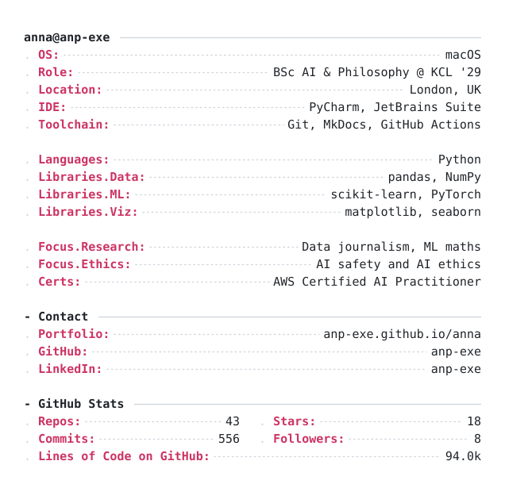

<!--
  anp-exe/anp-exe  —  profile README

  LAYOUT
  Two-column table: Melody + skill badges on the left, terminal stats card on
  the right. The badges live HERE and not inside the SVG on purpose — an SVG
  that GitHub serves as an  cannot load external images, so anything from
  skillicons.dev or shields.io has to be its own  in this file.

  Cell widths are PERCENTAGES, not pixels, so the columns stay in proportion on
  a phone. With a fixed px width the left cell cannot shrink, so on a narrow
  screen the card cell compresses while the left column keeps its size and ends
  up dominating. The px widths on the images below act as maximums only —
  GitHub's own CSS (max-width: 100%) scales them down inside a narrower cell.

  THE CARD
  assets/terminal.svg (dark) + terminal_light.svg (light) are the SOURCE OF
  TRUTH for the card's layout — edit them directly if you want.

  assets/update_stats.py rewrites only the stat numbers, in place, by element
  id. That is what .github/workflows/terminal-stats.yml runs twice a day.

  assets/generate_readme.py REBUILDS both SVGs from scratch. Only run it to
  change the layout. PORTRAIT_MODE is "none" so the card is text only.

  If the card looks stale after a push: GitHub proxies README images through
  camo and caches them per-URL. It clears on its own; to force it, append ?v=2
  (then ?v=3) to the image URLs below.
-->

<table>
  <tr>
    <td width="26%" valign="top" align="center">

<!--
  Credly badge. If the image ever fails to load, swap the src for the URL
  Credly itself advertises in the badge page's og:image tag:
  https://images.credly.com/images/4d4693bb-530e-4bca-9327-de07f3aa2348/linkedin_thumb_image.png
  (that one is a wide LinkedIn thumbnail, so it will need a bigger width).
  The badge must stay Public in Credly or it won't render for visitors.
-->

  </td>
  <td width="74%" valign="top">

<a href="https://github.com/anp-exe">
  <picture>
    <source media="(prefers-color-scheme: dark)" srcset="./assets/terminal.svg">
    
  </picture>
</a>

  </td>
  </tr>
</table>
